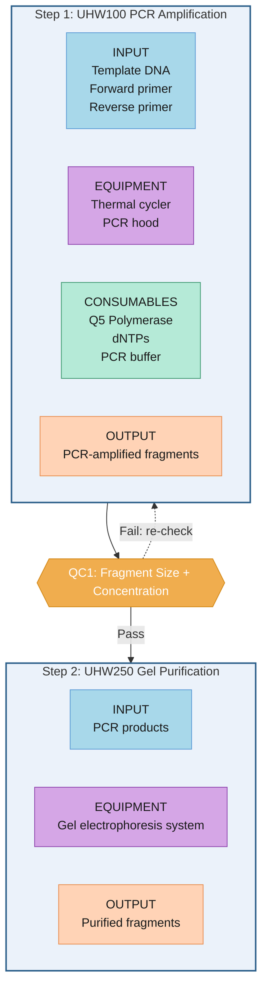
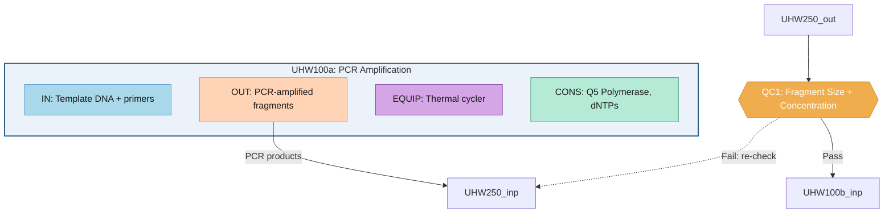

# Workflow Visualization Guide

## Overview

Each workflow variant is visualized as a directed Mermaid graph. Two rendering modes are available:

| Mode | Function | Description |
|------|----------|-------------|
| **Compact** (default) | `generate_compact_graph()` | Each UO is a subgraph with component boxes arranged horizontally (LR). All items shown. |
| **Detailed** (legacy) | `generate_detailed_graph()` | Each UO is a subgraph with individual component nodes and inter-node edges. Includes legend. |

CLI: `python visualize_workflow.py <wf_dir> <wf_id>` (compact by default, add `--detailed` for legacy mode).

## Data Compatibility

The visualization scripts support both canonical and legacy variant formats:

| Format | UO list key | Component access | Example |
|--------|------------|------------------|---------|
| **Canonical** | `unit_operations` | `uo.input`, `uo.equipment`, ... | WB005, WB010 (migrated) |
| **Legacy** | `uo_sequence` | `uo.components.input`, ... | older WB/WT files |

Helper functions:
- `_extract_uo_list(variant_data)` — reads `unit_operations` first, falls back to `uo_sequence`
- `_get_component(uo, key)` — reads `uo[key]` first, falls back to `uo["components"][key]`

## Component Color Scheme

| Component | Fill | Stroke | Text | Mermaid Class |
|-----------|------|--------|------|---------------|
| **Input** | `#A8D8EA` (sky blue) | `#5B9BD5` | `#1A1A1A` | `comp_input` |
| **Output** | `#FFD3B6` (peach) | `#E88D4F` | `#1A1A1A` | `comp_output` |
| **Equipment** (HW) / **Parameters** (SW) | `#D5A6E6` (purple) | `#8E44AD` | `#1A1A1A` | `comp_equipment` / `comp_parameters` |
| **Consumables** (HW) / **Environment** (SW) | `#B5EAD7` (mint) | `#3D9970` | `#1A1A1A` | `comp_consumables` / `comp_environment` |
| **Method** | `#FFEAA7` (yellow) | `#FDCB6E` | `#1A1A1A` | `comp_material_and_method` |

### Container Styles

| UO Type | Fill | Stroke |
|---------|------|--------|
| **HW UO** subgraph | `#EBF2FA` (light blue) | `#2C5F8A` |
| **SW UO** subgraph | `#EBF8EB` (light green) | `#3D7A3D` |

### QC Checkpoint
- Shape: Diamond (`{{ }}`)
- Fill: `#F0AD4E` (amber), Stroke: `#D48A1A`, Text: white
- Placed **outside** UO subgraphs, between steps

---

## Compact Mode (Default)

### Structure

- Overall flow: **TD** (top-to-bottom)
- Each UO: **subgraph** with `direction LR` (horizontal component boxes)
- Component boxes: multi-line label showing **all items** (`\n` separated)
- QC: diamond nodes between UO subgraphs with Pass/Fail branching
- No legend (colors are self-explanatory)

### Template



### Node ID Convention
- UO subgraph: `S{step_num}` (e.g., `S1`, `S2`, `S3`)
- Component nodes: `S{step_num}_{comp_3letter}` (e.g., `S1_inp`, `S1_equ`, `S1_con`, `S1_out`)
- QC nodes: `{qc_id}` (e.g., `QC1`, `QC2`)

### Component Order

| UO Type | Components (left to right) |
|---------|---------------------------|
| **HW** | input → equipment → consumables → material_and_method → output |
| **SW** | input → parameters → environment → material_and_method → output |

Empty components are skipped (no placeholder node).

### Label Construction
- First line: component prefix in ALL CAPS (e.g., `INPUT`, `EQUIPMENT`, `METHOD`)
- Subsequent lines: **all item names** from `items[].name`, each on its own line
- Individual items truncated at **60 characters** with "..."
- Fallback: if no `items`, try `description`, `procedure`, `environment` text fields
- Characters `"`, `#`, `&` are sanitized for Mermaid compatibility

### Edge Rules
- **UO → UO** (no QC): Solid arrow (`-->`) for HW, dashed (`-.->`) if SW involved
- **UO → QC**: Solid arrow from subgraph to QC diamond
- **QC → Pass**: Solid arrow with `"Pass"` label to next subgraph
- **QC → Fail**: Dashed arrow with `"Fail: {action}"` label back to same subgraph
- Fail action text comes from `qc_checkpoint.fail_action` (default: "re-check")

---

## Detailed Mode (Legacy)

Activated via `--detailed` CLI flag or `generate_mermaid_graph(..., detailed=True)`.

### Structure

Each UO is rendered as a subgraph containing up to 4 **individual component nodes** (Input, Output, Equipment/Parameters, Consumables/Environment). Inter-UO edges connect Output→Input nodes across subgraphs. Includes a color legend.

### Template



### Node ID Convention
- UO subgraph: `{uo_id}_{index}_sub`
- Component nodes: `{uo_id}_{index}_{comp_3letter}` (e.g., `UHW100_0_inp`)
- Component prefixes: `IN`, `OUT`, `EQUIP`, `PARAM`, `CONS`, `ENV`

### Label Construction (Detailed)
- Take up to **2 item names** per component, joined by ", "
- If >2 items, append `+N` (e.g., "DNA, Primers +1")
- Truncate at **40 characters** with "..."

### Edge Rules (Detailed)
- **Source**: Output node of preceding UO (`{uo_id}_{i}_out`)
- **Target**: Input node of following UO (`{uo_id}_{i}_inp`)
- **Label**: First output item name (max 30 characters)
- **HW → HW**: Solid arrow (`-->`)
- **SW involved**: Dashed arrow (`-.->`)
- **QC Pass/Fail**: Same as compact mode

### Legend
Every detailed mode diagram includes a color legend subgraph:

```mermaid
    subgraph Legend ["Color Legend"]
        L_in["Input"]:::comp_input
        L_out["Output"]:::comp_output
        L_eq["Equipment / Parameters"]:::comp_equipment
        L_co["Consumables / Environment"]:::comp_consumables
        L_qc{{"QC Checkpoint"}}:::qc
    end
    style Legend fill:#F9F9F9,stroke:#CCCCCC,stroke-width:1px
```

---

## Other Visualizations

### Variant Comparison Diagram
- Uses **simplified single-node-per-UO** view (not component subgraphs)
- Each variant is a separate subgraph with distinct color coding
- Save as: `05_visualization/variant_comparison.mmd`

### Workflow Context Graph (Modularity View)
Shows how this workflow connects to adjacent workflows in common service chains.


Save as: `05_visualization/workflow_context.mmd`

## Mermaid Generation Rules
1. Node IDs must be valid Mermaid identifiers (alphanumeric + underscore)
2. Edge labels in quotes
3. Use classDef for consistent styling
4. Add title as comment at top
5. All component nodes use consistent class colors regardless of UO
6. Subgraph containers differentiate HW (blue border) vs SW (green border)
