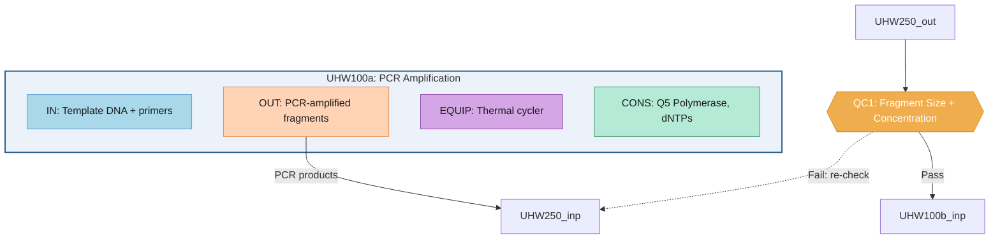

# Workflow Visualization Guide

## Overview
Each workflow variant is visualized as a directed graph where each UO is a **subgraph** containing up to 4 **component nodes** (Input, Output, Equipment/Parameters, Consumables/Environment). Inter-UO edges connect Output nodes to the next UO's Input nodes, showing physical and data flow.

## Component Color Scheme

| Component | Fill | Stroke | Text | Mermaid Class |
|-----------|------|--------|------|---------------|
| **Input** | `#A8D8EA` (sky blue) | `#5B9BD5` | `#1A1A1A` | `comp_input` |
| **Output** | `#FFD3B6` (peach) | `#E88D4F` | `#1A1A1A` | `comp_output` |
| **Equipment** (HW) / **Parameters** (SW) | `#D5A6E6` (purple) | `#8E44AD` | `#1A1A1A` | `comp_equipment` / `comp_parameters` |
| **Consumables** (HW) / **Environment** (SW) | `#B5EAD7` (mint) | `#3D9970` | `#1A1A1A` | `comp_consumables` / `comp_environment` |

### Container Styles

| UO Type | Fill | Stroke |
|---------|------|--------|
| **HW UO** subgraph | `#EBF2FA` (light blue) | `#2C5F8A` |
| **SW UO** subgraph | `#EBF8EB` (light green) | `#3D7A3D` |

### QC Checkpoint
- Shape: Diamond (`{{ }}`)
- Fill: `#F0AD4E` (amber), Stroke: `#D48A1A`, Text: white
- Placed **outside** UO subgraphs

## Diagram Structure (Mermaid subgraph)

### Template



### Node ID Convention
- UO subgraph: `{uo_id}_{index}_sub`
- Component nodes: `{uo_id}_{index}_{comp_3letter}` (e.g., `UHW100_0_inp`, `UHW100_0_out`, `UHW100_0_equ`, `UHW100_0_con`)
- Component prefixes: `IN` (Input), `OUT` (Output), `EQUIP` (Equipment), `PARAM` (Parameters), `CONS` (Consumables), `ENV` (Environment)

## Component Extraction Rules

### HW UO → 4 Components
1. `input` → `components.input.items[].name`
2. `output` → `components.output.items[].name`
3. `equipment` → `components.equipment.items[].name`
4. `consumables` → `components.consumables.items[].name`

### SW UO → 4 Components
1. `input` → `components.input.items[].name`
2. `output` → `components.output.items[].name`
3. `parameters` → `components.parameters.items[].name`
4. `environment` → `components.environment.items[].name`

### Label Construction
- Take up to **2 item names** per component, joined by ", "
- If >2 items, append `+N` (e.g., "DNA, Primers +1")
- Truncate at **40 characters** with "..."
- Characters `"`, `#`, `&` are sanitized for Mermaid compatibility

### Fallback Rules
- **Component has no `items` array or empty `items`**: Skip that component node entirely
- **All 4 components empty**: Fall back to single-node legacy style (`UO_ID: Instance Label`)
- **Output/Input node missing**: Use subgraph ID as edge endpoint fallback

## Edge Rules

### Inter-UO Edges
- **Source**: Output node of preceding UO (`{uo_id}_{i}_out`)
- **Target**: Input node of following UO (`{uo_id}_{i}_inp`)
- **Label**: First output item name (max 30 characters)

### Edge Styles
- **HW → HW**: Solid arrow (`-->`) — physical/material flow
- **SW involved**: Dashed arrow (`-.->`) — data flow
- **UO → QC**: Solid arrow, label = output item name
- **QC → Pass**: Solid arrow with `"Pass"` label
- **QC → Fail**: Dashed arrow with `"Fail: re-check"` label, loops back to previous UO's input

## Legend
Every generated Mermaid diagram includes a color legend subgraph at the bottom:

```mermaid
    subgraph Legend ["Color Legend"]
        L_in["Input"]:::comp_input
        L_out["Output"]:::comp_output
        L_eq["Equipment / Parameters"]:::comp_equipment
        L_co["Consumables / Environment"]:::comp_consumables
        L_qc{{"QC Checkpoint"}}:::qc
    end
    style Legend fill:#F9F9F9,stroke:#CCCCCC,stroke-width:1px
```

## Variant Comparison Diagram
- Uses **simplified single-node-per-UO** view (not component subgraphs)
- Each variant is a separate subgraph with distinct color coding
- Detailed component visualization is in per-variant `.mmd` files
- Save as: `05_visualization/variant_comparison.mmd`

## Format 2: Python Graphviz/Matplotlib Image

The script `scripts/visualize_workflow.py` also generates:
- DOT source → Graphviz rendering → PNG (300 DPI) and SVG
- Uses original blue/green HW/SW color scheme (not component colors)
- Node shapes: box (HW), roundedbox (SW), diamond (QC)
- Edge styles: solid (physical), dashed (data), colored (QC pass/fail)

Save as: `05_visualization/workflow_graph_{variant_id}.png`

## Additional Visualizations

### Workflow Context Graph (Modularity View)
Shows how this workflow connects to adjacent workflows in common service chains.
- **This workflow**: Standard blue/green UO nodes (detailed)
- **Adjacent workflows**: Gray collapsed nodes (single node per workflow)
- **Boundary edges**: Thick arrows labeled with transferred material/data


Save as: `05_visualization/workflow_context.mmd`

### Case-Variant Heatmap
- Rows: Cases (C001, C002, ...)
- Columns: Aligned step positions
- Cell color: Technique used at that step (categorical colormap)
- Clustering: Show how cases group into variants
- Tool: matplotlib/seaborn heatmap

### Parameter Distribution Charts
- For key parameters (temperature, time, concentration)
- Boxplot or violin plot showing distribution across cases
- Grouped by variant
- Tool: matplotlib

## Mermaid Generation Rules
1. Node IDs must be valid Mermaid identifiers (alphanumeric + underscore)
2. Edge labels in quotes
3. Use classDef for consistent styling
4. Maximum ~30 nodes per diagram (split complex workflows into subgraphs)
5. Add title as comment at top
6. All component nodes use consistent class colors regardless of UO
7. Subgraph containers differentiate HW (blue border) vs SW (green border)
