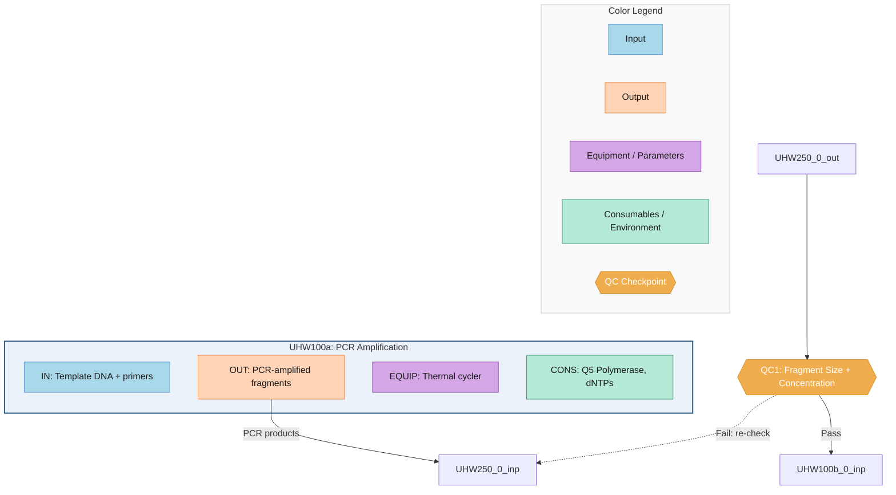

# Deep-Executor Consolidated Guide for Workflow Composition

This guide consolidates all sub-skill reference specifications into a single document
for deep-executor agents. Following this guide ensures output quality equivalent to
the sub-skill chaining approach (wf-literature + wf-analysis + wf-output).

---

## PHASE 2: LITERATURE COLLECTION

### 2.0 Full Text Acquisition (Script-Based)

After collecting paper_list.json (via OpenAlex search), run the following scripts
to fetch structured full text and validate data integrity BEFORE case extraction.

**Step 1: Fetch full text from PMC/Europe PMC**

```bash
python3 ~/.claude/skills/wf-literature/scripts/fetch_fulltext.py \
  --input {wf_dir}/01_papers/paper_list.json \
  --output {wf_dir}
```

This downloads PMC XML, parses into sections (ABSTRACT, INTRODUCTION, METHODS,
RESULTS, DISCUSSION), and saves as `01_papers/full_texts/{paper_id}.txt`
with `=== SECTION ===` headers. Only papers with PMCID and without
`has_full_text=True` are processed (incremental).

**Step 2: Validate paper data integrity**

```bash
python3 ~/.claude/skills/wf-literature/scripts/validate_papers.py \
  --paper-list {wf_dir}/01_papers/paper_list.json \
  --full-texts {wf_dir}/01_papers/full_texts/ \
  --check-pmid
```

Checks abstract-title relevance, full text-title matching, PMID cross-validation.
If any CRITICAL issues are found, remove the problematic paper and search for
a replacement before proceeding to case extraction.

**Step 3: Proceed to case extraction only when validation passes (0 critical)**

### Case Card Structure (MANDATORY)

Every case card MUST use this exact structure. Do NOT simplify.

```json
{
  "case_id": "{WF_ID}-C{NNN}",
  "metadata": {
    "pmid": "",
    "doi": "",
    "authors": "",
    "year": null,
    "journal": "",
    "title": "",
    "purpose": "",
    "organism": "",
    "scale": "",
    "automation_level": "manual|semi-automated|fully-automated",
    "core_technique": "",
    "fulltext_access": false,
    "access_method": "pmc_fulltext|websearch_synthesis|pubmed_abstract|knowledge_based",
    "access_tier": 1
  },
  "steps": [
    {
      "step_number": 1,
      "step_name": "",
      "description": "",
      "equipment": [
        {"name": "", "model": "", "manufacturer": ""}
      ],
      "software": [
        {"name": "", "version": "", "developer": ""}
      ],
      "reagents": "",
      "conditions": "",
      "result_qc": "",
      "notes": ""
    }
  ],
  "flow_diagram": "Step1 -> Step2 -> [QC] -> Step3",
  "workflow_context": {
    "service_context": "",
    "paper_workflows": [],
    "upstream_workflow": {
      "workflow_id": "",
      "workflow_name": "",
      "output_to_this": ""
    },
    "downstream_workflow": {
      "workflow_id": "",
      "workflow_name": "",
      "input_from_this": ""
    },
    "boundary_inputs": [],
    "boundary_outputs": []
  },
  "completeness": {
    "fulltext": false,
    "step_detail": "minimal|partial|detailed",
    "equipment_info": "none|partial|complete",
    "software_info": "none|partial|complete",
    "qc_criteria": false,
    "supplementary": false
  }
}
```

### 6 Extraction Principles

1. **Source Fidelity**: Record exactly what the paper states. Do NOT interpret or generalize.
2. **Comprehensive Extraction**: Check Methods, Supplementary, Figure legends, Table footnotes, Results.
3. **Preserve Differences**: Each paper's specific conditions recorded exactly. No merging across papers.
4. **Mark Missing**: Use `[미기재]` for missing info. NEVER guess or fill from general knowledge.
5. **Capture QC**: Identify QC from "verified by...", "confirmed using...", "was assessed..." phrases.
6. **Modular Boundaries**: Identify upstream/downstream workflows, boundary I/O.

### Equipment Field Rules

Equipment is a **structured array** with name, model, manufacturer:
- `{"name": "Thermal cycler", "model": "T100", "manufacturer": "Bio-Rad"}`
- If model not mentioned: `{"name": "Thermal cycler", "model": "[미기재]", "manufacturer": "[미기재]"}`
- Look in Methods, Supplementary, Figure legends, Acknowledgments for model info.

### Software Field Rules

Software is a **structured array** with name, version, developer:
- `{"name": "SnapGene", "version": "7.0", "developer": "Dotmatics"}`
- If no software in step: use empty array `[]`
- If version unknown: mark as `[미기재]`

---

## PHASE 3: ANALYSIS

### Step Alignment (step_alignment.json)

Align steps across all cases into functional positions:
```json
{
  "alignment": [
    {
      "aligned_position": 1,
      "function": "Design primers/sequences",
      "cases": {
        "C001": {"step_number": 1, "step_name": "..."},
        "C002": {"step_number": 1, "step_name": "..."},
        "C003": null
      }
    }
  ]
}
```

### Common Pattern (common_pattern.json)

Categories by frequency:
- **Mandatory**: Present in >=80% of cases
- **Conditional**: Present in specific technique subsets
- **Branch Point**: Where cases diverge into different techniques
- **Optional**: Present in <30% of cases

Include modularity section:
```json
{
  "modularity": {
    "boundary_inputs": [{"name": "", "frequency": 0.0, "typical_source": "", "case_refs": []}],
    "boundary_outputs": [{"name": "", "frequency": 0.0, "typical_destination": "", "case_refs": []}],
    "common_upstream": [{"workflow_id": "", "frequency": 0.0}],
    "common_downstream": [{"workflow_id": "", "frequency": 0.0}],
    "service_chains": [{"chain": [], "frequency": 0.0, "label": "", "case_refs": []}]
  }
}
```

### Cluster Result (cluster_result.json)

```json
{
  "clustering_method": "technique-first hierarchical",
  "primary_axis": "core_technique",
  "secondary_axes": ["scale", "automation_level"],
  "variants": [
    {
      "variant_id": "V1",
      "name": "",
      "qualifier": "",
      "case_ids": [],
      "case_count": 0,
      "defining_features": {}
    }
  ]
}
```

### Parameter Ranges (parameter_ranges.json)

```json
{
  "parameters": [
    {
      "step_function": "",
      "parameter": "",
      "unit": "",
      "values_by_case": {},
      "by_variant": {
        "V1": {"range": [], "typical": null, "n": 0}
      },
      "overall": {"range": [], "typical": null, "n": 0}
    }
  ]
}
```

### UO Mapping (uo_mapping.json)

Use multi-signal scoring:
- Equipment/Software match: weight 0.35
- Function match: weight 0.30
- I/O type match: weight 0.20
- Context match: weight 0.15
- Score >= 0.7: Strong match

```json
{
  "mappings": [
    {
      "step_function": "",
      "mapped_uo": {
        "uo_id": "",
        "uo_name": "",
        "instance_label": "",
        "mapping_score": 0.0,
        "evidence_tag": "",
        "supporting_cases": [],
        "signals": {"equipment": 0.0, "function": 0.0, "io": 0.0, "context": 0.0}
      }
    }
  ]
}
```

HW vs SW decision tree:
- Physical materials manipulation → UHW (Hardware)
- Data processing / software tools → USW (Software)
- Mixed → Split into separate HW and SW UOs

Same UO can appear multiple times: label as UHW100a, UHW100b, etc.

---

## PHASE 4: COMPOSITION — 7-Component Structure

### HW UO Components (MANDATORY structure)

Each Hardware UO MUST have these 7 structured components:

#### 1. Input
```json
{
  "items": [
    {
      "name": "PCR-amplified DNA fragments",
      "source_uo": "UHW100a (PCR Amplification)",
      "specifications": "100-500 ng each, 20 µL volume",
      "case_refs": ["C001", "C004"],
      "evidence_tag": "literature-direct"
    }
  ]
}
```

#### 2. Output
```json
{
  "items": [
    {
      "name": "Assembled DNA construct",
      "destination_uo": "UHW090 (Transformation)",
      "specifications": "circular plasmid, ~5-10 kb",
      "case_refs": ["C001", "C004"],
      "evidence_tag": "literature-direct"
    }
  ]
}
```

#### 3. Equipment
```json
{
  "items": [
    {
      "name": "Thermal cycler",
      "model": "T100",
      "manufacturer": "Bio-Rad",
      "settings": {
        "temperature": {"value": 50, "unit": "°C", "range": [50, 50], "evidence_tag": "literature-consensus"},
        "duration": {"value": 60, "unit": "min", "range": [15, 60], "evidence_tag": "literature-consensus"}
      },
      "case_refs": ["C001:Bio-Rad T100", "C004:[미기재]"],
      "evidence_tag": "literature-direct"
    }
  ]
}
```

#### 4. Consumables
```json
{
  "items": [
    {
      "name": "Gibson Assembly Master Mix",
      "catalog": "NEB E2611",
      "quantity": "10 µL per reaction",
      "case_refs": ["C001", "C007"],
      "evidence_tag": "literature-direct"
    }
  ]
}
```

#### 5. Material and Method
```json
{
  "environment": "Standard molecular biology lab",
  "procedure": "1. Combine equimolar amounts... [C001, C004]. 2. Add master mix... [C001]. 3. Incubate at 50°C... [C001: 60min, C004: 15min].",
  "case_refs": ["C001", "C004"],
  "evidence_tag": "literature-consensus"
}
```

#### 6. Result
```json
{
  "measurements": [
    {
      "metric": "Assembly efficiency",
      "value": "80-95% correct",
      "method": "Colony PCR + sequencing",
      "case_refs": ["C001: 90%", "C004: 85%"],
      "evidence_tag": "literature-direct"
    }
  ],
  "qc_checkpoint": {
    "measurement": "Colony PCR band pattern",
    "pass_criteria": "Expected band size ± 10%",
    "fail_action": "Re-optimize fragment ratios",
    "evidence_tag": "literature-consensus"
  }
}
```

#### 7. Discussion
```json
{
  "interpretation": "Gibson Assembly yields high efficiency for 2-4 fragments...",
  "troubleshooting": [
    {"issue": "Low colony count", "solution": "Increase fragment conc", "case_ref": "C004"}
  ],
  "special_notes": "For GC-rich regions, add 3% DMSO [C007].",
  "evidence_tag": "literature-consensus"
}
```

### SW UO Components (MANDATORY structure)

Software UOs use similar 7 components but with different field names:

1. **Input**: `items[]` with name, source_uo, format, specifications
2. **Output**: `items[]` with name, destination_uo, format, specifications
3. **Parameters**: `items[]` with name, value, range, description
4. **Environment**: `software[]` with name, version, developer, source, license + `runtime{}`
5. **Method**: `procedure` text with case references
6. **Result**: `measurements[]` + `qc_checkpoint{}`
7. **Discussion**: same as HW

### QC Checkpoint Structure

```json
{
  "qc_id": "QC001",
  "position": "Between UHW100a and UHW010",
  "measurement_items": [
    {
      "metric": "Band size on gel",
      "method": "1% agarose gel electrophoresis",
      "pass_criteria": "Single band at expected size ± 10%",
      "fail_action": "Re-optimize PCR conditions",
      "evidence_tag": "literature-consensus",
      "case_refs": ["C001", "C004"]
    }
  ]
}
```

QC Types: Go/No-Go (binary), Quantitative (threshold), Branching (determines path).

---

## PHASE 5: VISUALIZATION

### Mermaid Workflow Graphs — Component-Level Subgraph Style

CRITICAL: Use subgraph-per-UO with 4 internal component nodes. Do NOT use simple single-node style.

#### Color Scheme (6 colors)

| Component | Fill | Stroke | Class |
|-----------|------|--------|-------|
| Input | `#A8D8EA` | `#5B9BD5` | `comp_input` |
| Output | `#FFD3B6` | `#E88D4F` | `comp_output` |
| Equipment/Parameters | `#D5A6E6` | `#8E44AD` | `comp_equipment` |
| Consumables/Environment | `#B5EAD7` | `#3D9970` | `comp_consumables` |
| QC Checkpoint | `#F0AD4E` | `#D48A1A` | `qc` |
| HW UO subgraph | `#EBF2FA` | `#2C5F8A` | — |
| SW UO subgraph | `#EBF8EB` | `#3D7A3D` | — |

#### Template



#### Node ID Convention
- UO subgraph: `{uo_id}_{index}_sub`
- Input: `{uo_id}_{index}_inp`
- Output: `{uo_id}_{index}_out`
- Equipment: `{uo_id}_{index}_equ`
- Consumables: `{uo_id}_{index}_con`

#### Edge Rules
- HW -> HW: Solid arrow (`-->`) — material flow
- SW involved: Dashed arrow (`-.->`) — data flow
- QC -> Pass: Solid arrow with "Pass" label
- QC -> Fail: Dashed arrow with "Fail: re-check" label

#### Label Rules
- Max 2 item names per component, joined by ", "
- If >2 items: append "+N"
- Truncate at 40 characters with "..."

#### ALWAYS include Color Legend subgraph at bottom of every diagram.

### Variant Comparison Diagram
- Uses simplified single-node-per-UO view (not component subgraphs)
- Each variant is a separate subgraph

### Workflow Context Diagram
- Shows this workflow + adjacent upstream/downstream workflows
- This workflow: detailed UO nodes
- Adjacent workflows: gray collapsed single nodes
- Thick arrows labeled with transferred material/data

---

## PHASE 5: OUTPUT FILES

### composition_report.md — MANDATORY 13 Sections

**CRITICAL**: Use EXACTLY these section names and order. Do NOT rename, reorder, merge, or omit any section. Every `composition_report.md` MUST contain exactly these 13 `## ` headings:

| # | Exact Section Heading | Key Content |
|---|----------------------|-------------|
| 1 | Workflow Overview | Workflow description, scope |
| 2 | Literature Search Summary | Databases, paper counts, screening |
| 3 | Case Summary | Distribution by technique, scale, organism |
| 4 | Common Workflow Structure | Mandatory steps, branch points, QC |
| 5 | Variants | Each with UO sequence, 7-component summary, graph |
| 6 | Variant Comparison | Side-by-side comparison table + diagram |
| 7 | Parameter Ranges | Parameter ranges table |
| 8 | Equipment & Software Inventory | Model/manufacturer/version/developer tables + coverage stats |
| 9 | Evidence and Confidence | Evidence tag distribution table |
| 10 | Modularity and Service Integration | Boundary I/O, service chains |
| 11 | Limitations and Notes | Data limitations, methodological notes |
| 12 | Catalog Feedback | UO issues, WF issues, component gaps |
| 13 | Execution Metrics | Phase timings from execution_log.json |

**FORBIDDEN alternative names**: "Executive Summary", "Scope and Objectives", "Literature Basis", "Case Distribution", "Case Analysis", "Step Alignment", "Clustering and Variant Definition", "UO Mapping Summary", "QC Checkpoints", "Decision Guide", "Workflow Context", "Related Workflows", "Composition Metadata", "Cross-Platform Comparison", "Quality Control Framework". Do NOT use these.

### composition_data.json — Required Fields

Must include:
- `statistics`: papers, cases, variants, UOs, QC checkpoints, confidence
- `modularity`: boundary_inputs, boundary_outputs, upstream, downstream, service_chains
- `common_skeleton`: aligned positions
- `variants`: each with variant_name, case_ids, unit_operations (with full 7-component structure)
- `parameter_ranges`
- `equipment_software_inventory`: equipment (name/model/manufacturer) + software (name/version/developer) + coverage stats
- `limitations`
- `catalog_feedback`: uo_issues, wf_issues, component_gaps, summary

### composition_workflow.md — MANDATORY 5 Sections

**CRITICAL**: Use EXACTLY these section names and order. Do NOT rename or omit.

| # | Exact Section Heading | Key Content |
|---|----------------------|-------------|
| 1 | Common Workflow Skeleton | Pos / Function / Mandatory / UO / Type table |
| 2 | Variants | Per-variant `### V{n}: {name}` subsections, each with UO Sequence table (Step, UO ID, UO Name, Instance Label, Type, Key Equipment/Software, Key Parameters) + QC Checkpoints |
| 3 | Parameter Quick-Reference | Parameter / Range / Unit / Variants / Cases table |
| 4 | Boundary I/O | Direction / Workflow / Material/Data table |
| 5 | Service Chains | Numbered list of observed chains with frequencies |

**FORBIDDEN alternative names**: "Quick Reference", "Variant Overview", "Overview", "Variant Selection Guide", "Upstream/Downstream", "Method Selection Guide". Do NOT use these. Do NOT add extra sections like ranking guides.

### Korean Translations

- composition_report_ko.md: Same 13 sections, Korean prose, technical terms untranslated
- composition_workflow_ko.md: Same structure, Korean headers, technical terms untranslated

---

## EVIDENCE TAGGING (ALL PHASES)

| Priority | Tag | Description |
|---|---|---|
| 1 | `literature-direct` | Paper Methods/Results direct extraction |
| 2 | `literature-supplementary` | From supplementary materials |
| 3 | `literature-consensus` | Multiple cases agree |
| 4 | `manufacturer-protocol` | Equipment/kit manufacturer docs |
| 5 | `expert-inference` | Inferred — reasoning required |
| 6 | `catalog-default` | UO catalog default (last resort) |

EVERY value in variant files must have `case_refs` and `evidence_tag`. No exceptions.

---

## QUALITY CHECKLIST

### Case Cards
- [ ] All steps from Methods section captured
- [ ] Equipment as structured array (name, model, manufacturer) — NOT string list
- [ ] Software as structured array (name, version, developer) — NOT string list
- [ ] `[미기재]` used for ALL missing information (never guess)
- [ ] flow_diagram present
- [ ] workflow_context with upstream/downstream and boundary I/O
- [ ] completeness assessment filled

### Analysis
- [ ] step_alignment with case-level traceability
- [ ] cluster_result with technique-first clustering
- [ ] common_pattern with modularity section
- [ ] parameter_ranges with by_variant breakdown

### Variant Files
- [ ] 7-component structure with `items[]` arrays (NOT flat text strings)
- [ ] Equipment items have name/model/manufacturer/settings
- [ ] Consumables have catalog numbers where available
- [ ] material_method has numbered procedure steps with case refs
- [ ] result has measurements[] with case-specific values
- [ ] discussion has interpretation + troubleshooting[] + special_notes

### Visualization
- [ ] Subgraph-per-UO with 4 component nodes (IN/OUT/EQUIP/CONS)
- [ ] 6-color scheme (not 3-color)
- [ ] Color Legend subgraph at bottom
- [ ] Edge labels on inter-UO connections
- [ ] QC as diamond nodes outside subgraphs
- [ ] HW subgraph: light blue border; SW subgraph: light green border

### Reports
- [ ] composition_report.md has all 13 sections including Equipment Inventory and Catalog Feedback
- [ ] composition_data.json has modularity, equipment_software_inventory, catalog_feedback
- [ ] composition_workflow.md has Equipment/Software columns and Boundary I/O section
